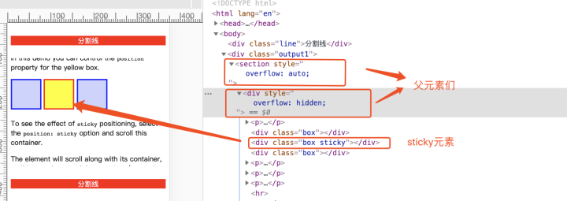
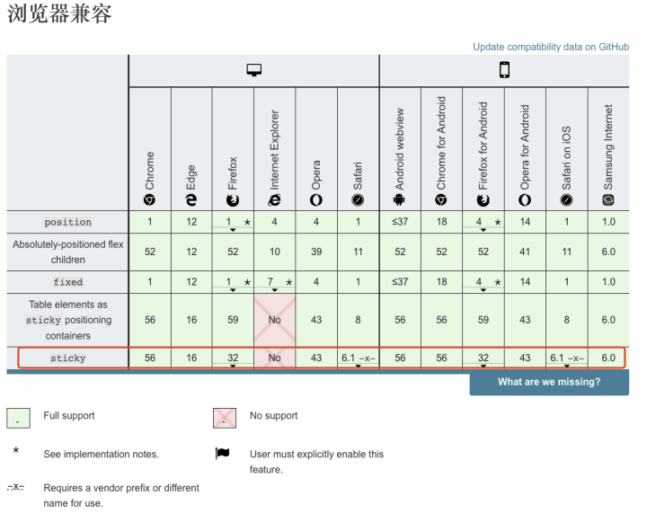

CSSposition属性用于指定一个元素在文档中的定位方式。在这篇分享中，我们不讨论relative, absolute, fixed值，我们来看看一个只有部分浏览器支持的值sticky。

#### 目录如下：

- 简单介绍
- 实现预览
- 特性
- 运用
- oops: (
- 兼容性

##### 简单介绍
position有个属性叫sticky，称为粘（zhan）性定位元素。从名字上推断，表示把物体A和物体B连接在一起。回到前端的范畴，意思就是，将设置此属性的元素，粘在网页的某个位置上。须指定 top,right,bottom或 left四个阈值其中之一，才可使粘性定位生效。否则其行为与相对定位相同。

##### 实现预览
<video width="320" height="240" controls>
  <source src="/Users/zhoukun6/Documents/fe/sticky/demo1.mp4" type="video/mp4">
</video>

<video width="320" height="240" controls>
  <source src="/Users/zhoukun6/Documents/fe/sticky/demo2.mp4" type="video/mp4">
</video>

##### 特性
1. 粘性定位可以被认为是相对定位和固定定位的混合。元素在跨越特定阈值前为相对定位，之后为固定定位。但是跟固定定位又不太一样的，偏移值不会影响任何其他元素的位置。也就是说，没有脱离文档流。
2. 须指定 top irght bottom 或 left 四个阈值其中之一，才可使粘性定位生效。否则其行为与相对定位相同。
3. 元素根据正常文档流进行定位，然后相对它的最近滚动祖先（nearest scrolling ancestor）和 containing block (最近块级祖先 nearest block-level ancestor)，包括table-related元素，基于top, right, bottom, 和 left的值进行偏移。
4. 该值总是创建一个新的层叠上下文（stacking context）。
5. 一个sticky元素会“固定”在离它最近的一个拥有“滚动机制”的祖先上（当该祖先的overflow 是 hidden, scroll, auto, 或 overlay时），即便这个祖先不是真的滚动祖先。这个阻止了所有“sticky”行为（详情见Github issue on W3C CSSWG）。
6. 父级元素overflow属性只能设置visible值，否则没有粘滞效果。
7. html结构很重要。

##### 运用
在实际环境中的运用，我们可以来看下。
1. 粘性定位常用于定位字母列表的头部元素。标示 B 部分开始的头部元素在滚动 A 部分时，始终处于 A 的下方。而在开始滚动 B 部分时，B 的头部会固定在屏幕顶部，直到所有 B 的项均完成滚动后，才被 C 的头部替代。代码和图文如下。
```
<div class="output3">
    <dl>
        <dt>A</dt>
        <dd>Andrew W.K.</dd>
        <dd>Apparat</dd>
        <dd>Arcade Fire</dd>
        <dd>At The Drive-In</dd>
        <dd>Aziz Ansari</dd>
    </dl>
    <dl>
        <dt>C</dt>
        <dd>Chromeo</dd>
        <dd>Common</dd>
        <dd>Converge</dd>
        <dd>Crystal Castles</dd>
        <dd>Cursive</dd>
    </dl>
    <dl>
        <dt>E</dt>
        <dd>Explosions In The Sky</dd>
    </dl>
    <dl>
        <dt>T</dt>
        <dd>Ted Leo & The Pharmacists</dd>
        <dd>T-Pain</dd>
        <dd>Thrice</dd>
        <dd>TV On The Radio</dd>
        <dd>Two Gallants</dd>
    </dl>
</div>

.output3 {
    height: 200px;
    overflow: auto;
}
```
<video width="320" height="240" controls>
  <source src="/Users/zhoukun6/Documents/fe/sticky/letter.mp4" type="video/mp4">
</video>

​
2. 中间状态的导航栏
这种交互主要用于商城网站页面下，在页面中间有个tabbar导航，而这个导航是随着页面的滚动，会固定在页面的某个位置上。
```
<nav>
    <h3>烧酒</h3>
    <h3>红酒</h3>
    <h3>白酒</h3>
</nav>

<div class="line">分割线</div>
nav {
 display: flex;
 position: sticky;
 margin-top: 300px;
 top: 0;
}


nav h3 {
 flex: 1 0 auto;
 outline: 1px solid #fff;
 background-color: lightskyblue;
 color: #fff;
 text-align: center;
 padding: 4px;
}
.line {
 background: red;
 margin: 30px 0;
 text-align: center;
 color: #fff;
}
body {
 background: lightcoral;
 height: 5000px;
}
```
<video width="320" height="240" controls>
  <source src="/Users/zhoukun6/Documents/fe/sticky/nav.mp4" type="video/mp4">
</video>


​
3. 富有层次的滚动交互
滚动下面这个嵌入页面的滚动条，我们可以看到新闻标题依次推上去，网友评论也会在恰当的时间从背后钻出来。
```
<article>
    <section>
        <h4>粘性定位</h4>
        <content>
            <p>粘性定位可以被认为是相对定位和固定定位的混合。元素在跨越特定阈值前为相对定位，之后为固定定位。例如：
            </p>
        </content>
        <footer>须指定 top, right, bottom 或 left 四个阈值其中之一，才可使粘性定位生效。否则其行为与相对定位相同。</footer>
    </section>
    <section>
        <h4>粘性定位</h4>
        <content>
            <p>
                在 viewport 视口滚动到元素 top 距离小于 10px 之前，元素为相对定位。之后，元素将固定在与顶部距离 10px 的位置，直到 viewport 视口回滚到阈值以下。
            </p>
            <p>
                粘性定位常用于定位字母列表的头部元素。标示 B 部分开始的头部元素在滚动 A 部分时，始终处于 A 的下方。而在开始滚动 B 部分时，B 的头部会固定在屏幕顶部，直到所有 B 的项均完成滚动后，才被 C 的头部替代。
            </p>

        </content>
        <footer>amazing!!!</footer>
    </section>
    <section>
        <h4>粘性定位</h4>
        <content>
            <p>粘性定位可以被认为是相对定位和固定定位的混合。元素在跨越特定阈值前为相对定位，之后为固定定位。例如：
            </p>
        </content>
        <footer class="last">须指定 top, right, bottom 或 left 四个阈值其中之一，才可使粘性定位生效。否则其行为与相对定位相同。</footer>
    </section>
</article>

article h4, 
article footer {
    position: -webkit-sticky;  /* for Safari */
    position: sticky;
}

article h4 {
    margin: 2em 0 0;
    background-color: lightslategray;
    color: #fff;
    padding: 10px;
    top: 0;
    z-index: 1;
}
article content {
    display: block;
    background-color: lightskyblue;
    position: relative;
    padding: 1px 10px;
}
article footer {
    background-color: #f0f3f9;
    padding: 10px;
    bottom: 50vh;
    z-index: -1;
}
```
<video width="320" height="240" controls>
  <source src="/Users/zhoukun6/Documents/fe/sticky/富有层次的滚动.mov" type="video/mp4">
</video>
​

##### oops: (
1. 一个sticky元素会“固定”在离它最近的一个拥有“滚动机制”的祖先上（当该祖先的overflow 是 hidden, scroll, auto, 或 overlay时），即便这个祖先不是真的滚动祖先。这个阻止了所有“sticky”行为（详情见Github issue on W3C CSSWG）。



<video width="320" height="240" controls>
  <source src="/Users/zhoukun6/Documents/fe/sticky/设置overflow失效.mov" type="video/mp4">
</video>

​
2. 设置了position:sticky粘性定位的元素的父元素如果高度大于等于粘性定位元素的高度，则垂直滚动超过父元素高度的时候，粘性定位会失效。
```
<div>
    <section>
        <div class="output2">
            <p>In this demo you can control the <code>position</code> property for the yellow box.</p>
            <div class="box"></div>
            <div class="wrapper">
                <div class="box sticky"></div>
            </div>
            <div class="box"></div>
            <p>To see the effect of <code>sticky</code> positioning, select the <code>position: sticky</code> option
                and scroll this container.</p>
            <p>The element will scroll along with its container, until it is at the top of the container (or reaches
                the offset specified in <code>top</code>), and will then stop scrolling, so it stays visible.</p>
            <p>The rest of this text is only supplied to make sure the container overflows, so as to enable you to
                scroll it and see the effect.</p>
            <hr>
            <p>Far out in the uncharted backwaters of the unfashionable end of the western spiral arm of the Galaxy
                lies a small unregarded yellow sun. Orbiting this at a distance of roughly ninety-two million miles
                is an utterly insignificant little blue green planet whose ape-descended life forms are so amazingly
                primitive that they still think digital watches are a pretty neat idea.</p>
        </div>
    </section>
</div>

.box {
 display: inline-block;
 background-color: rgba(0,0,255,.2);
 border: 3px solid #00f;
 width: 65px;
 height: 65px;
}

.wrapper {
 display: inline-block;
 height: 150px;
 background-color: lightgreen;
}

.output2 {
 height: 250px;
 overflow: auto;
}

.sticky {
 position: sticky;
 top: 20px;
 background-color: #ff0;
 border: 3px solid red;
}
```
<video width="320" height="240" controls>
  <source src="/Users/zhoukun6/Documents/fe/sticky/高度超过时失效.mov" type="video/mp4">
</video>

​
##### 兼容性


